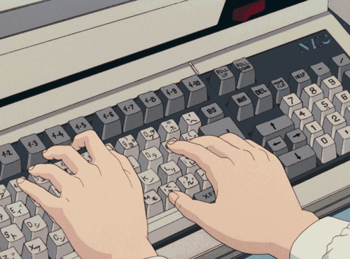

  
👋 Hi, I’m Ece

 
  
to my fancy Github Page

# About  Me

- 🙀 I'm about 23 years old.

- 🏚️ I live in a city that is not well-known.

- 🗺️ In a country located in the heart of Europe.

- 📄 In the last 3 years, I achieved my Developer Diploma.

- 🕹️ I’m interested in game and web development.

- ⏳ I’m currently working full-time for a furniture company.

# What do I do
- 🌱 Developing Web-Apps

- 👾 Creating mini games

- 🍜 Eating ramen

- ⚡ Beeing funny

# Socials

⤵️ If you want to visit my portfolio site, feel free to do so! ♿️

⤵️ You can also follow me on my social media

(I know you’re a bit of a stalker 👀)

☕️ Can you buy me a coffee then, my little stalker?

# Goodbye

🍀 Have fun and good luck with everything!

